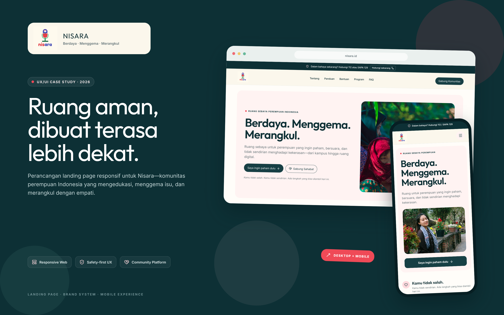

# Nisara — Ruang Aman & Komunitas Perempuan Indonesia

<div align="center">



### *Berdaya · Menggema · Merangkul*

**Sebuah platform ruang aman sebaya (peer support) dan edukasi interaktif untuk perempuan Indonesia.**  
Dirancang dengan pendekatan *trauma-informed design*, navigasi yang ringan, aksesibilitas menyeluruh, serta protokol keselamatan privasi tingkat tinggi.

---

[](https://nextjs.org/)
[](https://react.dev/)
[](https://www.typescriptlang.org/)
[](https://tailwindcss.com/)
[](https://www.framer.com/motion/)
[](LICENSE)

[🌸 Jelajahi Fitur](#-fitur-unggulan--pengalaman-pengguna) • [🛡️ Protokol Keselamatan](#-protokol-keselamatan-survivor) • [🎨 Desain Sistem](#-filosofi-desain--design-tokens) • [📱 Responsivitas](#-responsivitas-lintas-perangkat) • [💻 Tech Stack](#-arsitektur--teknologi) • [🚀 Quickstart](#-menjalankan-proyek)

---

</div>

## 📖 Gambaran Proyek

**Nisara** hadir sebagai respons nyata terhadap maraknya normalisasi pelecehan dan kekerasan terhadap perempuan—baik di ruang publik, lingkungan kampus, tempat kerja, hingga ruang digital. 

Bukan sekadar situs informasi statis, Nisara dikembangkan sebagai **antarmuka empati** (*empathy-driven interface*) yang memprioritaskan rasa tenang, kejelasan informasi pertolongan pertama, dan validasi emosional bagi siapa pun yang membutuhkan bantuan tanpa rasa takut dihakimi.

> *"Percaya pada cerita, hormati pilihan, jaga kerahasiaan."*  
> — Prinsip Dasar Gerakan Sahabat Nisara

---

## ✨ Fitur Unggulan & Pengalaman Pengguna

### 1. 🛡️ Akses Cepat Bantuan Darurat & Hotline Nasional
- **Fixed Emergency Top Bar**: Bilah darurat yang terkunci di puncak layar pada seluruh perangkat, menyediakan akses panggil langsung 1-klik (*tap-to-call*) ke **112** (Panggilan Darurat Terpadu) dan **SAPA 129** (KemenPPPA).
- **Direktori 6 Kanal Bantuan Resmi**: Kurasi kontak resmi lengkap meliputi Hotline 112, SAPA 129, 110 Kepolisian, Komnas Perempuan, UPTD PPA/LBH Apik, serta Satgas PPKS Kampus.

### 2. ⚡ Tombol Keluar Cepat (*Quick Exit Mechanism*)
- Dirancang khusus untuk situasi berisiko tinggi saat korban sedang mengakses situs dan diawasi oleh orang lain.
- Tersedia sebagai tombol melayang ergonomis dan dapat dipicu instan dengan tombol keyboard **`ESC`**.
- Seketika membersihkan sesi peramban (`sessionStorage.clear()`) dan mengalihkan halaman ke pencarian Google netral.

### 3. 🎯 Panduan Interaktif Survivor (*Step-by-Step Safety Guide*)
- 4 langkah terstruktur penanganan mandiri saat mengalami insiden:
  1. *Amankan Diri & Cari Titik Terang*
  2. *Dokumentasikan Bukti Tanpa Mengubah Aslinya*
  3. *Hubungi Bantuan Resmi Terdekat*
  4. *Cari Ruang Pemulihan & Peer Support*
- Dilengkapi modal dialog detail yang menyajikan *checklist* praktis langkah demi langkah.

### 4. 🤝 Formulir Keterlibatan Berkelanjutan
- **Sahabat Nisara**: Registrasi relawan dengan perlindungan privasi ketat (nama panggilan opsional, kontak aman, dan persetujuan data eksplisit).
- **Komponen Custom Dropdown**: Pilihan peran teranimasi halus dengan Framer Motion, bebas dari masalah *layout overflow*, serta mendukung navigasi keyboard penuh.
- **Kemitraan Institusi**: Kanal kolaborasi bagi kampus, komunitas, korporasi (CSR), dan organisasi advokasi.

---

## 🛡️ Protokol Keselamatan & Privasi

Privasi pengguna adalah fondasi utama arsitektur Nisara:

| Fitur Keselamatan | Implementasi Teknis | Dampak bagi Pengguna |
|---|---|---|
| **Zero Trackers** | Tanpa script pelacak iklan pihak ketiga (no Meta Pixel, no Google Ads) | Aktivitas pengguna tidak dapat diprofilkan oleh pihak luar |
| **Quick Exit (ESC)** | `window.location.replace("https://www.google.com")` | Riwayat halaman langsung ditimpa (*replace state*) |
| **Sanitasi Sesi** | `sessionStorage.clear()` & `localStorage` minimalis | Tidak meninggalkan jejak formulir yang sedang diisi |
| **Tips Penyamaran** | Panduan bawaan untuk menggunakan *Incognito / Private Browsing* | Mengedukasi pengguna cara berselancar secara aman |

---

## 🎨 Filosofi Desain & Design Tokens

Nisara menggunakan pendekatan **Trauma-Informed Design**: menghindari warna-warna klinis yang memicu kepanikan atau warna gelap yang mengintimidasi. Warna kanvas dirancang hangat (*warm neutrals*) menyerupai kertas buku (*Paper*), dipadukan dengan aksen *Plum* yang teduh dan *Terracotta* yang berani.

### Palet Warna Resmi

| Token | Nilai Hex | Peran dalam Antarmuka |
|---|---|---|
| **Plum** | `#173F44` | Elemen primer, judul, tombol utama (*Primary CTA*) |
| **Plum Dark** | `#0D3035` | Background 3 Pilar, Top Bar Darurat, Footer |
| **Soft Cream** | `#FFF3F2` | Latar kartu informasi & aksen lembut |
| **Paper** | `#FFFDF9` | Warna kanvas latar utama (hangat, tidak silau di mata) |
| **Terracotta** | `#EF4A57` | Aksen penanda penting, badge langkah, tombol darurat |
| **Sage** | `#DDF1EA` | Banner tips privasi & status konfirmasi sukses |
| **Line** | `#DEE8E6` | Garis batas (*border*) minimalis berkarakter halus |

### Tipografi
- **Heading**: [Outfit](https://fonts.google.com/specimen/Outfit) — Humanis, hangat, ramah, namun memiliki ketegasan dalam menyuarakan isu penting.
- **Body Text**: [Inter](https://fonts.google.com/specimen/Inter) — Keterbacaan tinggi (*high legibility*) di layar ponsel terkecil sekalipun.

---

## 📱 Responsivitas Lintas Perangkat

Antarmuka Nisara dibangun dengan filosofi **Mobile-First & Fluid Geometry**:

- 📱 **Mobile (320px – 640px)**: Navigasi drawer halus, tombol sentuh berukuran minimal **48×48px** sesuai pedoman WCAG AAA, dan bar aksi cepat di bagian bawah layar.
- 💻 **Tablet & Laptop (768px – 1024px)**: Tata letak grid multi-kolom adaptif dengan tipografi proporsional.
- 🖥️ **Desktop & Layar Lebar (>1280px)**: Kontainer konten terpusat (*max-w-1296px*) dengan hierarki visual lapang dan nyaman dibaca.
- 🚫 **Anti-Horizontal Scroll**: Menggunakan `overflow-x: clip` modern untuk mengeliminasi potensi pergeseran horizontal yang tidak diinginkan.

---

## 💻 Arsitektur & Teknologi

```text
Frontend Framework   : Next.js 15 (App Router, Server & Client Components)
UI Library           : React 19
Bahasa Pemrograman   : TypeScript 5
Sistem Styling       : Tailwind CSS 3
Engine Animasi       : Framer Motion 12
Paket Ikon           : Lucide React
Optimasi Deployment  : Static Site Generation (SSG) / GitHub Pages Export
Automated CI/CD      : GitHub Actions
```

### Struktur Repositori

```text
├── .github/workflows/
│   └── deploy.yml              # Alur otomatis deploy ke GitHub Pages
├── public/
│   └── images/
│       ├── cover.png           # Aset visual cover beresolusi Retina
│       └── nisara-logo.png     # Identitas visual resmi
├── src/
│   ├── app/
│   │   ├── disclaimer/         # Batasan tanggung jawab hukum & medis
│   │   ├── kebijakan-privasi/  # Kebijakan transparansi data pengguna
│   │   ├── layout.tsx          # Shell aplikasi, font, dan open-graph metadata
│   │   └── page.tsx            # Komposisi 12 section landing page
│   ├── components/
│   │   ├── layout/             # Top bar darurat, navbar fixed, footer
│   │   ├── sections/           # Modul konten: Hero, 3 Pilar, Panduan, Form
│   │   └── ui/                 # CustomSelect, QuickExitButton, Card
│   └── data/
│       └── content.ts          # Single source of truth teks & data layanan
└── next.config.mjs             # Konfigurasi static export & routing
```

---

## 🚀 Menjalankan Proyek

Bagi kontributor atau pengembang yang ingin menjalankan proyek ini di lingkungan lokal:

```bash
# 1. Clone repositori
git clone https://github.com/<username>/<repo-name>.git
cd <repo-name>

# 2. Pasang dependensi
npm install

# 3. Jalankan server lokal
npm run dev

# 4. Build produksi
npm run build
```

Buka peramban Anda di `http://localhost:3000`.

---

## 🤝 Bergabung & Berkolaborasi

Gerakan Nisara terbuka bagi siapa saja yang ingin berkontribusi menciptakan ruang yang lebih adil dan aman bagi perempuan:

- 📷 **Instagram**: [@nisaraid](https://instagram.com/nisaraid)
- 📣 **Tagar Gerakan**: `#SahabatNisara` · `#BerdayaMenggemaMerangkul` · `#RuangAmanPerempuan`

---

<div align="center">

Dibuat dengan kepedulian untuk seluruh perempuan tangguh Indonesia.  
**© 2026 Nisara. Hak Cipta Dilindungi.**

</div>
